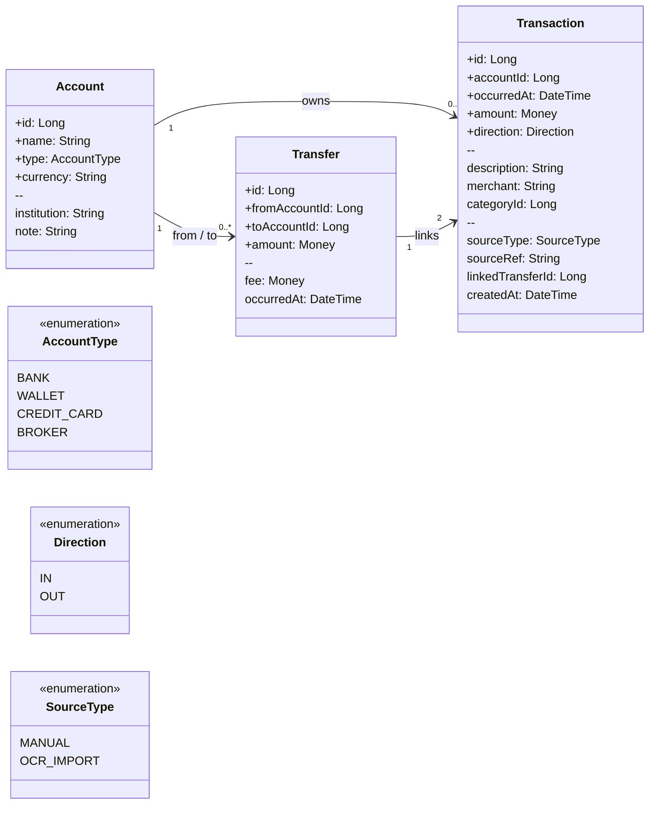

```mermaid

classDiagram
    direction LR

    class Account {
        +id: Long
        +name: String
        +type: AccountType
        +currency: String
        --
        institution: String
        note: String
    }

    class Transaction {
        +id: Long
        +accountId: Long
        +occurredAt: DateTime
        +amount: Money
        +direction: Direction
        --
        description: String
        merchant: String
        categoryId: Long
        --
        sourceType: SourceType
        sourceRef: String
        linkedTransferId: Long
        createdAt: DateTime
    }

    class Transfer {
        +id: Long
        +fromAccountId: Long
        +toAccountId: Long
        +amount: Money
        --
        fee: Money
        occurredAt: DateTime
    }

    class AccountType {
        <<enumeration>>
        BANK
        WALLET
        CREDIT_CARD
        BROKER
    }

    class Direction {
        <<enumeration>>
        IN
        OUT
    }

    class SourceType {
        <<enumeration>>
        MANUAL
        OCR_IMPORT
    }

    Account "1" --> "0..*" Transaction : owns
    Transfer "1" --> "2" Transaction : links
    Account "1" --> "0..*" Transfer : from / to

```